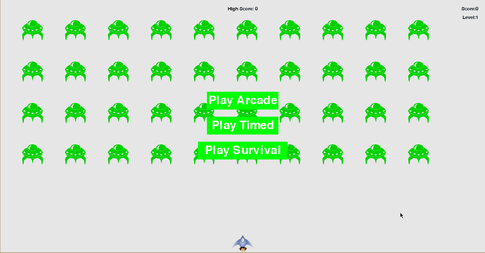

  

<h1 align="center">Alien Shooter</h1>

<h5 align = "center">The good ol' <strong>Space Invaders</strong> game developed using Pygame</h5>

-----------------------------------------
### Motivation, Challenge & Accomplishment

* **Motivation:** On my journey of seeing what the hype about Python is all about and learning it, I came across a book 'Python Crash Course' and this game is inspired from the boilerplate project given in the book.

* **Challenge:** Extending the boilerplate code given in the book and making it my own. This was the first time I had worked with a large project in Python as far as
object oriented architecture was concerned. I had to keep in mind all the files, classes and methods and achieve the desired functionality.

* **Accomplishment:** Developed 3 modes of gaming instead of just one in the boilerplate code given in the book. Additionally, was able to code keeping in mind the
PEP8 guidelines.

------------------------------------------
### Tech Stack

- **Python 3.7+** needs to be installed.
Get the latest version [here](https://www.python.org/downloads/release/python-372/)
- **Pygame** needs to be installed. Execute this command in CLI: `python -m pip install pygame`

***

### Modes

- **Arcade**: With three lives, pass as many levels as you can with the highest score possible.
- **Timed**: Try to kill as many aliens as you can in 2 minutes!
- **Survival**: The toughest of them all! You have only one life to kill those aliens.

***

### Controls

- `LARROW`: Move ship left.
- `RARROW` : Move ship right.
- `SPACEBAR`: Shoot.
- `Q`: Quit the game.

**Gamers' Note**: You can only have a certain number of bullets onscreen at a time.

***

### Demo

    

------------------------------------------
### Installation 

Alas, no Python library in my knowledge supports executable file generation for Python 3.7 yet. Let me know if you find one! :)
- Clone or download the repository onto your local system.
- To play the game, run `alien_shooter.py` via the CLI or any Python IDE. Enjoy! 

------------------------------------------
### License
This project is licensed under the MIT - see the [LICENSE](./LICENSE) file for details.
